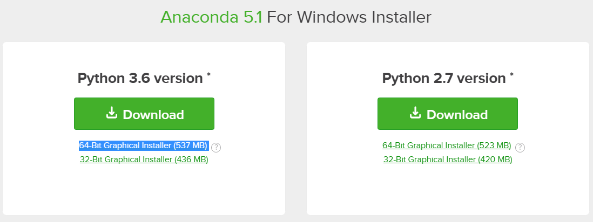
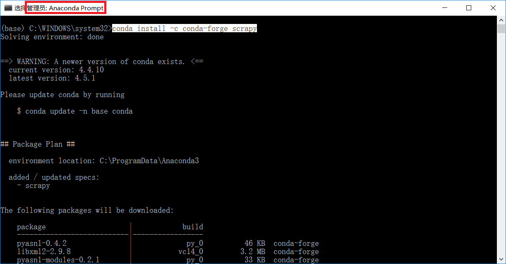
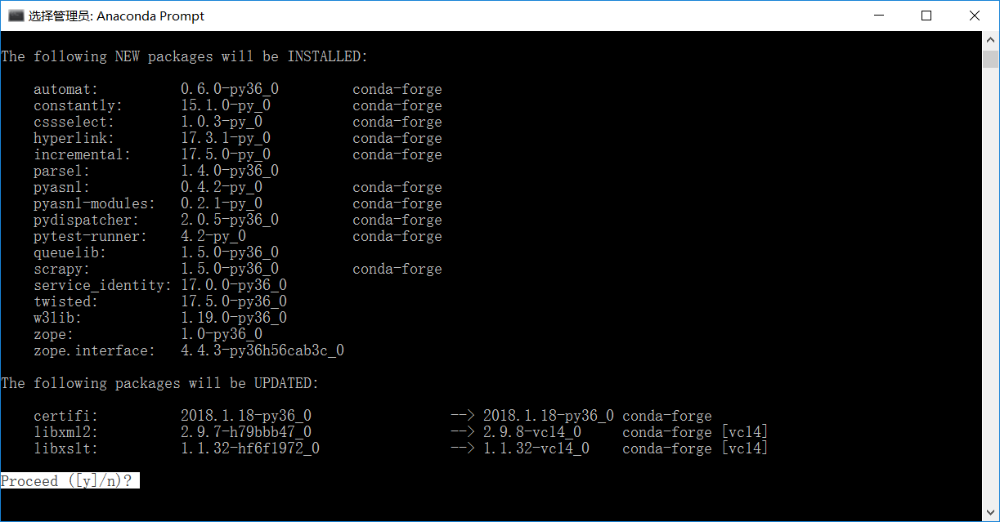
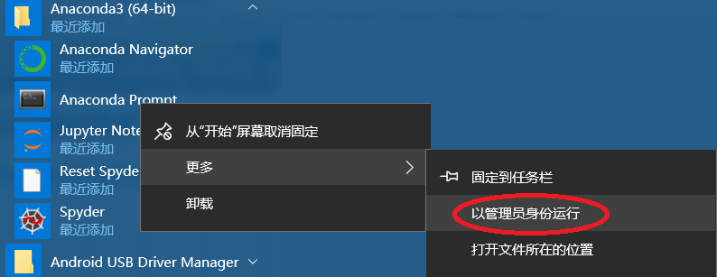

# Amazon 搜索查询使用步骤

1. 打开 https://www.anaconda.com/download/ ， 下载Installer。参考
2. 运行下载好的exe文件，安装。
3. 以管理员方式打开anaconda prompt，参考
4. 在窗口中执行 conda install -c conda-forge scrapy ，参考
   中途问是否继续，回车即可。参考

5. 将代码解压缩，进入代码所在目录，执行命令 scrapy crawl start_search -a search="action camera" -a expect="vantop"
  引号部分可替换成实际需要的. 参考
  

6. 匹配到第一个搜索结果后会退出程序。
   同时输出一个csv文件，包含已经搜索到的产品列表。
